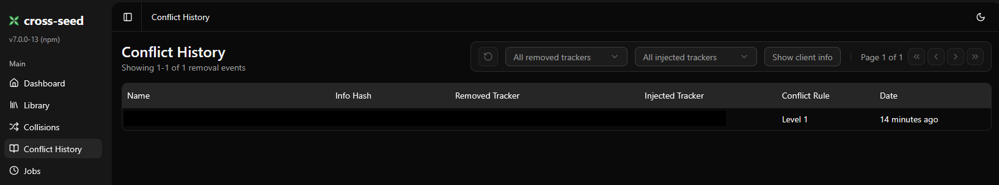

# cross-seed fork with info hash collision handling

This is a fork of cross-seed: https://github.com/cross-seed/cross-seed/

Based on the cross-seed v7 pre-release (includes the Web UI).

> **Warning:** This fork changes the database schema and behavior. Before
> installing or upgrading, make a backup of `cross-seed.db`. If you ever want to
> return to the stock version, you will need that backup.

## Why this fork

This fork exists to handle info hash collisions. An info hash collision happens
when two different torrents share the same `info_hash`. In that case, cross-seed
detects a duplicate and refuses to inject, which blocks cross-seeding even when
the torrent comes from another tracker.

In such a situation, it is not viable to inject a second announce for the same
torrent (often rejected by private trackers). It is also risky to rely on a
second client to work around the issue in case of file corruption, and private
trackers may detect that as abuse.

This fork helps you detect conflicting torrents and take action.

## Features

- Detects collisions by identifying tracker differences between the candidate
  and the seeding torrent
- Defines rules to replace a conflicting torrent by setting tracker priorities

### Collisions view

By default, if there are no Conflict Rules, collisions are surfaced in the
Collisions view for manual handling. You can report the issue to the trackers
involved or remove the conflicting torrents from the bittorrent client manually.

A `Collision Recheck` job regularly verifies whether a conflicting torrent has
been removed from the bittorrent client, then allows the candidate to be
injected.

### Conflict Rules

By default, this feature is disabled.

Conflict Rules allow tracker priority to be defined to solve collisions
automatically. This is a way to promote seeding on preferred trackers for
whatever reason. When rules apply, a conflicting torrent from a lower-priority
tracker is removed from the bittorrent client without deleting the data, and the
selected candidate is injected as a replacement.

> **Note:** The `All indexer trackers` rule only covers active indexers from the
> Trackers Settings page. If an indexer is temporarily down, it will be treated
> as a third-party tracker. When configuring rules, explicitly select all
> desired trackers to avoid unwanted torrent replacement.

### Conflict History

To track torrent removal actions performed by cross-seed, a Conflict History
view has been added.

## Docker image

Multiarch AMD64/ARM64 images are available at:

`ghcr.io/pilounk/cross-seed:collisions`

## Usage

After migrating from the stock cross-seed version, you will likely want to clear
old decisions that may have been collisions (`SAME_INFO_HASH` /
`INFO_HASH_ALREADY_EXISTS`) so the search job can evaluate them again.

This command will clear only these related decisions:

`docker exec -it cross-seed cross-seed reset-stock-decisions`
